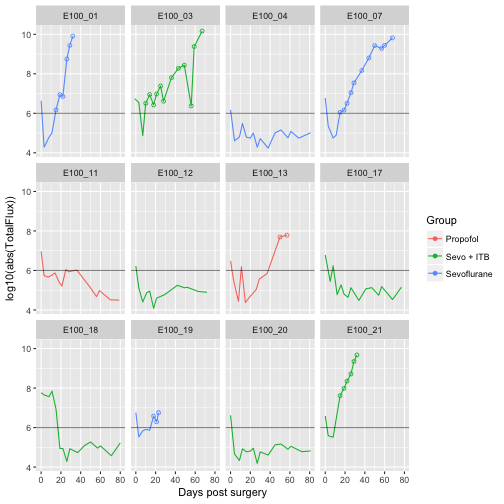

```{r setup, include=FALSE}
knitr::opts_chunk$set(echo = FALSE)
```

## Motivation - ggplot2 as an R "killer app"

- Visualize early



## Outline

- Decide on working folder
- Fire up Rstudio
- Set the working directory
- Fetch the working data
- ggplot2 fundamentals
- hands on practice

## ggplot2 fundamentals

How data layout is different to traditional plotting routines

Can seem counter intuitive, but provides great flexibility

## Basic plot

```{r libs, echo=FALSE, message=FALSE, include=FALSE}
library(tidyverse)
x <- seq(0, pi, by=0.05)
y <- sin(x) + rnorm(length(x), sd = 0.05)
y2 <- cos(x) + rnorm(length(x), sd = 0.05)

```

```{r echo=FALSE}
print(head(round(y, 3)))
```

```{r echo=FALSE}
plot(y, type='l')
```

## Scatter plot

```{r}
head(tibble(x=round(x,3), y=round(y,3)))
```
## Scatter plot

```{r echo=FALSE}
plot(x, y, type='l')
```

## Multiple lines
```{r echo = FALSE}
head(tibble(y1=round(y, 3), y2=round(y2, 3)))
```

## Multiple lines
```{r echo = FALSE}
matplot(x, cbind(y, y2), type='l')
```

## Data with different lengths/different sampling
```{r, echo=FALSE}
x1 <- seq(0, pi, by=0.05)
x2 <- seq(0, pi, by=0.1)
y1 <- sin(x1) + rnorm(length(x1), sd = 0.05)
y2 <- cos(x2) + rnorm(length(x2), sd = 0.05)

A <- tibble(x=x1, y=y1, group="A")
B <- tibble(x=x2, y=y2, group="B")
dat <- bind_rows(A, B)
```

```{r echo=TRUE}
plot(x1, y1, type='l')
lines(x2, y2, type='l')
```

## Explicit grouping

- All of the previous structures can be represented using a common form
- one X column, one Y column, one grouping variable.
- less efficient (RAM), but very convenient.
- common data structure - common code for everything...

## Explicit grouping
```{r }
slice_sample(dat, n=8)
```

Can have as many groups as we want - still only use 3 columns.

## Practice

